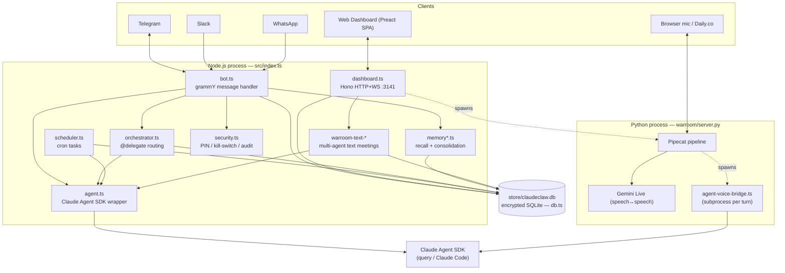
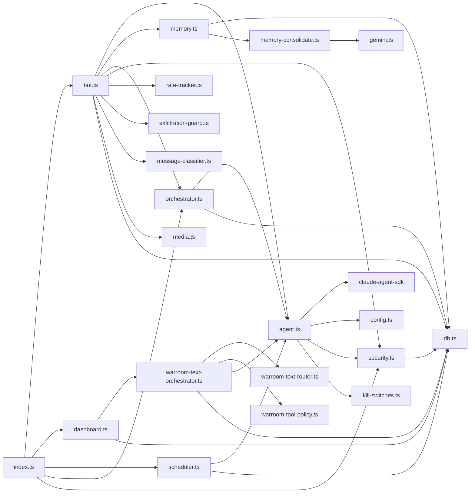
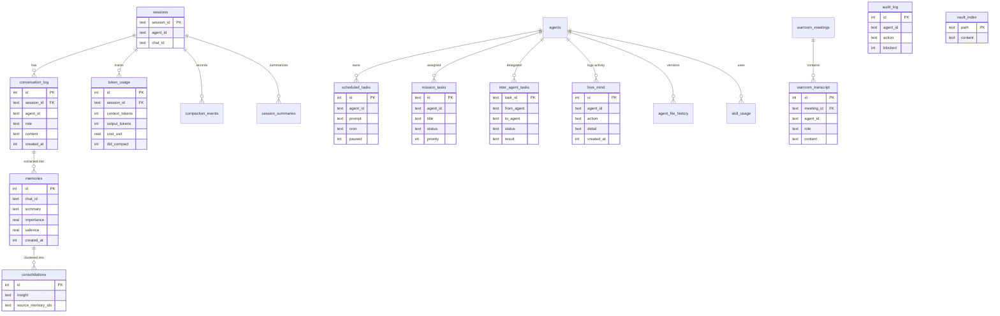

# ClaudeClaw — Codebase Inventory

> Generated 2026-06-05. A map of where every component lives, ranked by importance, with architecture + data-model diagrams.

ClaudeClaw is a personal Claude Code assistant reachable over Telegram (plus a web dashboard, a voice/text "War Room", and a Slack/WhatsApp bridge). It runs as a persistent Node.js service on a Mac/Linux box, wraps the `@anthropic-ai/claude-agent-sdk`, and supports a fleet of named sub-agents (main, research, comms, content, ops, vault) that share one encrypted SQLite store.

- **Language/runtime:** TypeScript on Node ≥20 (`tsx` dev, `tsc` build → `dist/`), plus a Python voice stack (Pipecat + Gemini Live).
- **Frontend:** Preact + Vite SPA under `web/` (built to `dist/web/`); legacy server-rendered HTML kept as fallback.
- **Storage:** `better-sqlite3` at `store/claudeclaw.db`, field-encrypted with `DB_ENCRYPTION_KEY`.
- **Entry point:** `src/index.ts` → `npm start` (`node dist/index.js [--agent <id>]`).

---

## 1. Runtime architecture

**Key flows**
- **Telegram turn:** `bot.ts` receives → security gate (`security.ts`) → memory context (`memory.ts`) → `agent.ts runAgent()` (Claude Agent SDK) → reply, with file-send markers and cost footer. Delegation (`@research: …`) routed by `orchestrator.ts`.
- **Scheduled turn:** `scheduler.ts` fires cron → runs an agent turn → pushes result to Telegram.
- **Voice War Room:** `dashboard.ts` spawns `warroom/server.py` (auto-respawn, max 3 crashes). Gemini Live does speech↔speech; tool calls spawn `agent-voice-bridge.ts` to run a specialist agent.
- **Text War Room:** `warroom-text-orchestrator.ts` runs a router classifier (Haiku) → primary agent + up to 2 interveners, streamed over SSE.

---

## 2. Component inventory (ranked by importance)

### Tier 0 — Core runtime (the spine)

| Component | Path | Lines | Role |
|---|---|---|---|
| **Process entry** | `src/index.ts` | 398 | Boots DB, security, orchestrator, scheduler, dashboard, War Room subprocess; handles `--agent` flag, PID lock, graceful shutdown. |
| **Agent engine** | `src/agent.ts` | 565 | Wraps `@anthropic-ai/claude-agent-sdk` `query()`. MCP loading, retries/fallback chain, usage accounting, compaction detection, the empty-`result.text` recovery (reads session `.jsonl`). |
| **Telegram bot** | `src/bot.ts` | 1799 | grammY handler. The real control plane: streaming edits, context-warning, smart routing, exfiltration guard, rate/budget limits, media, delegation dispatch, security commands. |
| **Database** | `src/db.ts` | 3083 | `better-sqlite3` access layer, 146 exported fns over ~27 tables. Field encryption via `DB_ENCRYPTION_KEY`. The data hub every subsystem reads/writes. |
| **Config** | `src/config.ts` | 267 | Reads `.env`, exposes typed config + mutable per-agent overrides (`setAgentOverrides`). |

### Tier 1 — Primary subsystems

| Component | Path | Lines | Role |
|---|---|---|---|
| **Dashboard server** | `src/dashboard.ts` | 3108 | Hono HTTP+WS server (:3141, token-gated). REST API for tasks/missions/agents/memories/audit/chat/warroom; serves the SPA. |
| **Orchestrator** | `src/orchestrator.ts` | 253 | Parses `@agent:`/`/delegate`, runs sub-agents in-process, logs to `inter_agent_tasks` + `hive_mind`. |
| **Scheduler** | `src/scheduler.ts` | 250 | cron-parser driven scheduled tasks, per-task model override, pushes results to Telegram. |
| **Memory recall** | `src/memory.ts` | 371 | Builds `[Memory context]` block, relevance scoring, decay sweep, nudges. |
| **Memory ingest** | `src/memory-ingest.ts` | 278 | Extracts/stores memories from conversation turns. |
| **Memory consolidation** | `src/memory-consolidate.ts` | 172 | Periodic (30 min) cross-memory pattern finding via Gemini. |
| **Security** | `src/security.ts` | 334 | PIN lock, idle auto-lock, emergency kill phrase, destructive-action confirm, audit callback, SDK env scrubbing. |
| **Agent config** | `src/agent-config.ts` | 274 | Loads `agents/<id>/agent.yaml` + `CLAUDE.md`, resolves dirs, War Room roster file. |

### Tier 1.5 — War Room (voice + text)

| Component | Path | Lines | Role |
|---|---|---|---|
| **Voice server (Python)** | `warroom/server.py` | 811 | Pipecat pipeline + Gemini Live; tool handlers (`delegate_to_agent`, `answer_as_agent`, `get_time`, `list_agents`). |
| **Text orchestrator** | `src/warroom-text-orchestrator.ts` | 2047 | `handleTextTurn()` — dedupe, router, primary + intervener gates, transcript persistence, tool policy. |
| **Text UI** | `src/warroom-text-html.ts` | 3268 | Three-zone SSE-driven page (roster / transcript / composer), XSS-hardened. |
| **Voice UI** | `src/warroom-html.ts` | 2057 | Cinematic Pipecat WebSocket client, agent reveal, live transcript. |
| **Voice bridge** | `src/agent-voice-bridge.ts` | 210 | CLI subprocess spawned by Pipecat; runs a specialist via SDK, returns JSON. |
| **Text router** | `src/warroom-text-router.ts` | 343 | Haiku classifier → `{primary, interveners, reason}`, failure-tolerant. |
| **Text events** | `src/warroom-text-events.ts` | 215 | Per-meeting SSE channel with bounded replay ring buffer. |
| **Tool policy** | `src/warroom-tool-policy.ts` | 128 | Per-agent tool/MCP allowlist; default-deny Bash/Write/Edit. |
| **Voice routing/personas** | `warroom/router.py` (266), `warroom/personas.py` (203), `warroom/daily_agent.py` (469), `warroom/agent_bridge.py` (181) | — | Name/broadcast routing, persona prompts, Daily.co video agent, legacy STT→Claude→TTS bridge. |
| Picker / text-html helpers | `src/warroom-text-picker-html.ts` (378) | — | Voice-vs-text mode picker. |

### Tier 2 — Channels, CLIs & support

| Component | Path | Role |
|---|---|---|
| Slack bridge | `src/slack.ts`, `src/slack-cli.ts` | Slack send/read; CLI wrapper. |
| WhatsApp bridge | `src/whatsapp.ts`, `scripts/wa-daemon.ts`, `scripts/wa-read.ts` | whatsapp-web.js daemon + outbox. |
| Schedule CLI | `src/schedule-cli.ts` | `create/list/delete/pause/resume` scheduled tasks. |
| Mission CLI | `src/mission-cli.ts` | Queue async tasks to other agents (Mission Control). |
| Agent-create CLI | `src/agent-create.ts` (800), `src/agent-create-cli.ts` | Scaffold a new sub-agent (dir, yaml, CLAUDE.md, bot token). |
| Meet CLI | `src/meet-cli.ts` (904) | Daily.co room create/join for avatar video calls. |
| Daily client | `src/daily-client.ts` | REST wrapper for Daily.co rooms/tokens. |
| Voice utils | `src/voice.ts` (503) | Audio/ffmpeg/avatar helpers. |
| Gemini | `src/gemini.ts` | Gemini API client (video understanding, consolidation). |
| Media | `src/media.ts` | Telegram media download + message builders. |
| Migrations | `src/migrations.ts`, `migrations/version.json`, `scripts/migrate.ts` | Schema version check + runner. |

### Tier 3 — Guards, policy & utilities

| Component | Path | Role |
|---|---|---|
| Kill switches | `src/kill-switches.ts` | Per-feature enable/disable gates. |
| Exfiltration guard | `src/exfiltration-guard.ts` | Scans/redacts secrets in outbound text. |
| Rate tracker | `src/rate-tracker.ts` | Hourly token / daily cost budgets. |
| Message classifier | `src/message-classifier.ts` | Complexity → smart model routing. |
| Cost footer | `src/cost-footer.ts` | Per-turn cost line. |
| OAuth health | `src/oauth-health.ts` | Optional Claude CLI token expiry alerts. |
| Skill registry / health | `src/skill-registry.ts`, `src/skill-health.ts` | Discover + health-check Claude skills. |
| Avatars | `src/avatars.ts` | Agent avatar storage + migration. |
| Errors / Platform / State | `src/errors.ts`, `src/platform.ts`, `src/state.ts` | Error classification, OS helpers, in-process event/abort state. |
| Obsidian | `src/obsidian.ts`, `scripts/obsidian-ingest.ts` | Vault indexing into `vault_index`. |
| Misc | `src/env.ts`, `src/env-write.ts`, `src/embeddings.ts`, `src/logger.ts`, `src/message-queue.ts`, `src/hooks.ts` | Env IO, embeddings, pino logger, queue, SDK hooks. |

### Tier 4 — Web SPA (`web/`, Preact + Vite → `dist/web/`)

| Area | Files | Role |
|---|---|---|
| Shell | `web/src/App.tsx`, `main.tsx`, `lib/routes.ts`, `lib/api.ts`, `lib/chat-stream.ts` | Router, token-injected HTTP client, SSE chat stream. |
| Pages | `web/src/pages/*.tsx` | MissionControl, Scheduled, Agents, AgentFiles, Chat, Memories, HiveMind, Usage, Audit, WarRoom, Voices, Settings. |
| 3D brain | `web/src/components/BrainGraph3D.tsx`, `BrainGraph.tsx`, `lib/webgl.ts` | Three.js hive-mind activity visualization (lazy-loaded). |
| Components | `web/src/components/*.tsx` | Sidebar, CommandPalette, ModelPicker, ScheduleBuilder, AgentDetail, modals, UI primitives. |
| Lib helpers | `web/src/lib/*.ts` | theme, personalization, cron humanizer, markdown, formatting, hooks. |
| Legacy fallback | `src/dashboard-html.ts` (2843) | Server-rendered HTML; only used when `dist/web/` missing or `DASHBOARD_LEGACY=true`. |

### Tier 5 — Config, ops & assets (non-`src/`)

| Area | Path | Role |
|---|---|---|
| Project instructions | `CLAUDE.md`, `CLAUDE.md.example` | Persona + operating rules injected as system prompt. |
| Agents | `agents/<id>/{agent.yaml,CLAUDE.md,.claude/}`, `agents/_template/` | Per-agent config, persona, MCP/tool allowlist. |
| Env | `.env`, `.env.example` | Tokens, keys, feature flags. |
| Ops scripts | `scripts/*.{sh,ts}` | setup, status, notify, launchd install, gws-keepalive, briefing-digest, battle-tests, avatar gen. |
| Service | `claudeclaw.plist`, `launchd/`, `scripts/install-launchd.sh` | macOS launchd service definitions. |
| Bundled skills | `skills/` | gmail, google-calendar, slack, timezone, tldr, pikastream-video-meeting. |
| Docs | `docs/` | incident-runbook, rfc-sdk-engine, warroom-mcp-policy. |
| Build/test | `vite.config.ts`, `vitest.config.ts`, `tsconfig.json`, `src/*.test.ts` | Vitest suites colocated in `src/`. |
| Assets | `assets/`, `banner.txt`, `web/public/brain.glb` | Branding + 3D model. |

---

## 3. Module dependency map (Node side)

---

## 4. Data model (key SQLite tables — `src/db.ts`)

~27 tables; the load-bearing ones and their relationships:

> Note: several tables exist in both a current and `*_new` form (`sessions`/`sessions_new`, `mission_tasks`/`mission_tasks_new`) — migration scaffolding. Additional tables not shown: `dashboard_settings`, `agent_suggestions`, `skill_health`, `meet_sessions`, `slack_messages`, `wa_messages`, `wa_message_map`, `wa_outbox`.

---

## 5. Where to start (by task)

| I want to… | Start here |
|---|---|
| Change how Telegram messages are handled | `src/bot.ts` |
| Change how an agent turn runs (SDK, retries, model) | `src/agent.ts` |
| Add/modify a DB table or query | `src/db.ts` + `migrations/` |
| Add a dashboard API route | `src/dashboard.ts` |
| Add/change a dashboard page | `web/src/pages/` + `web/src/lib/routes.ts` |
| Tune multi-agent delegation | `src/orchestrator.ts` |
| Work on voice War Room | `warroom/server.py` + `src/agent-voice-bridge.ts` |
| Work on text War Room | `src/warroom-text-orchestrator.ts` |
| Add a scheduled job | `src/scheduler.ts` / `node dist/schedule-cli.js` |
| Adjust security / kill switches | `src/security.ts`, `src/kill-switches.ts` |
| Add a new sub-agent | `agents/_template/` + `src/agent-create.ts` |
| Change memory behavior | `src/memory.ts`, `src/memory-ingest.ts`, `src/memory-consolidate.ts` |

*Line counts are approximate (snapshot 2026-06-05). Test files (`src/*.test.ts`) sit alongside their modules.*
